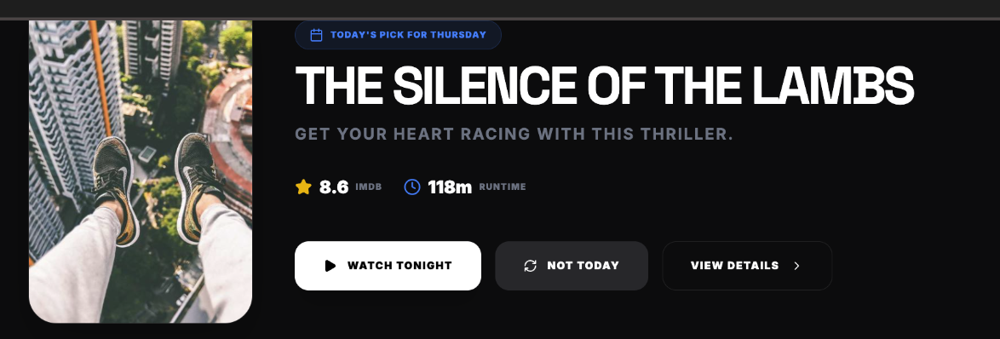
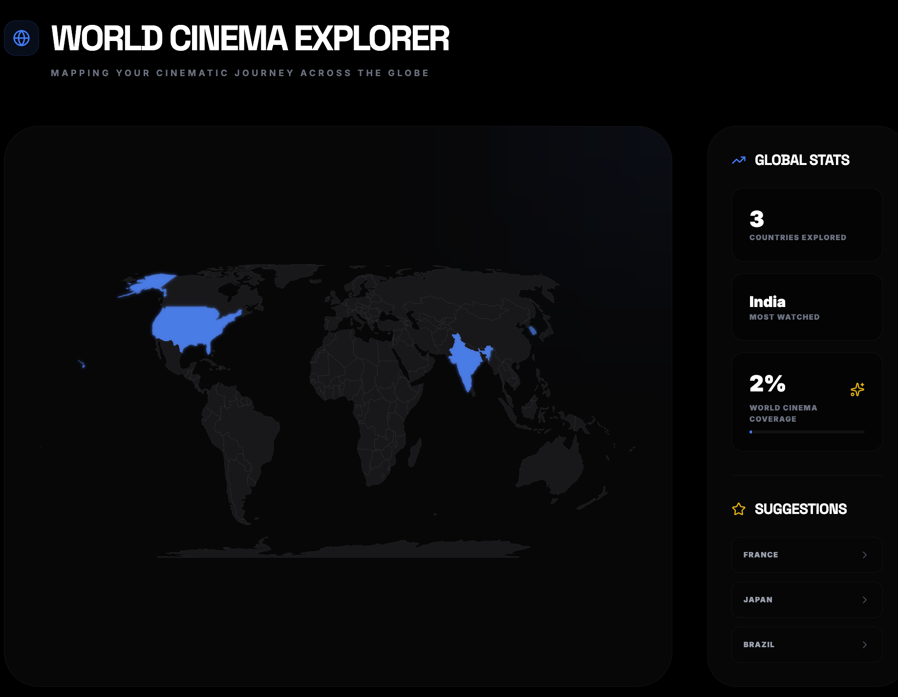
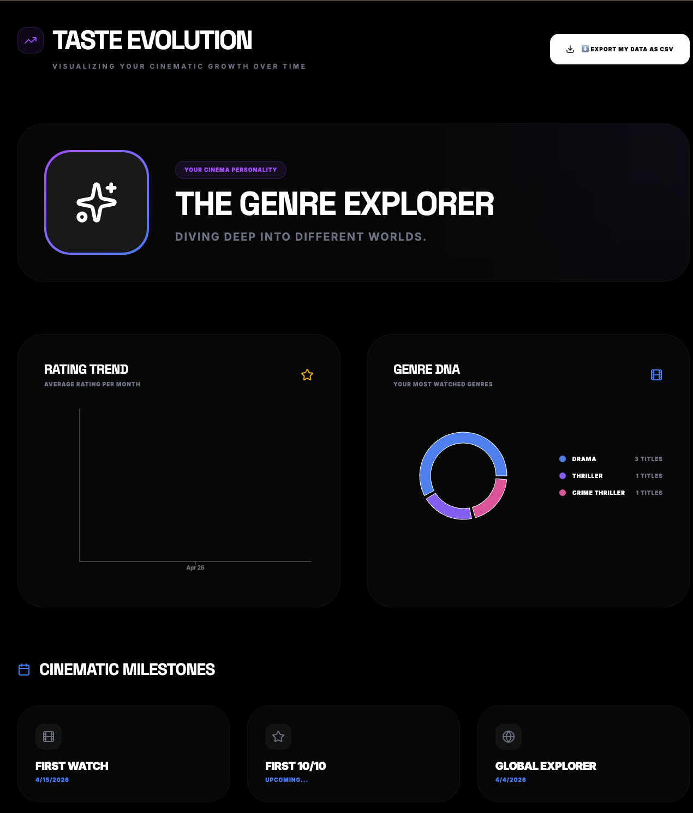
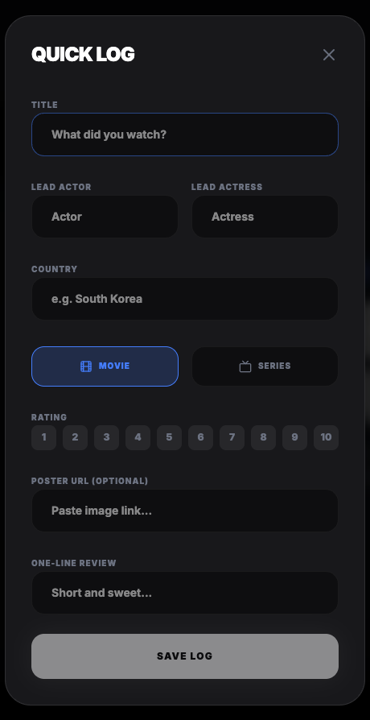
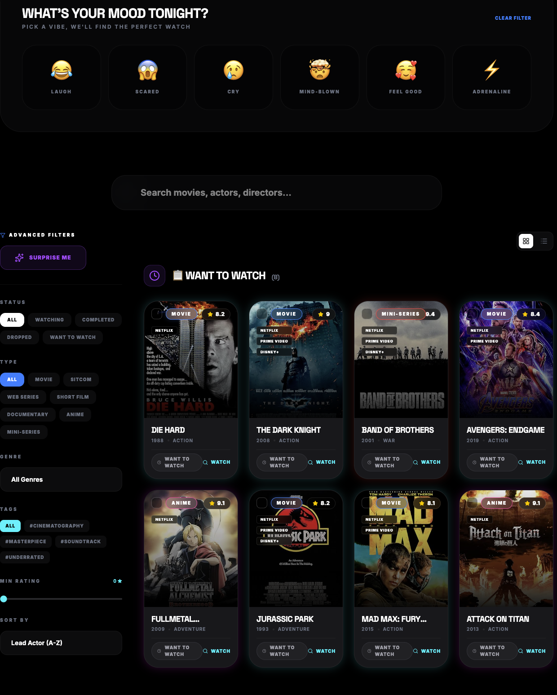
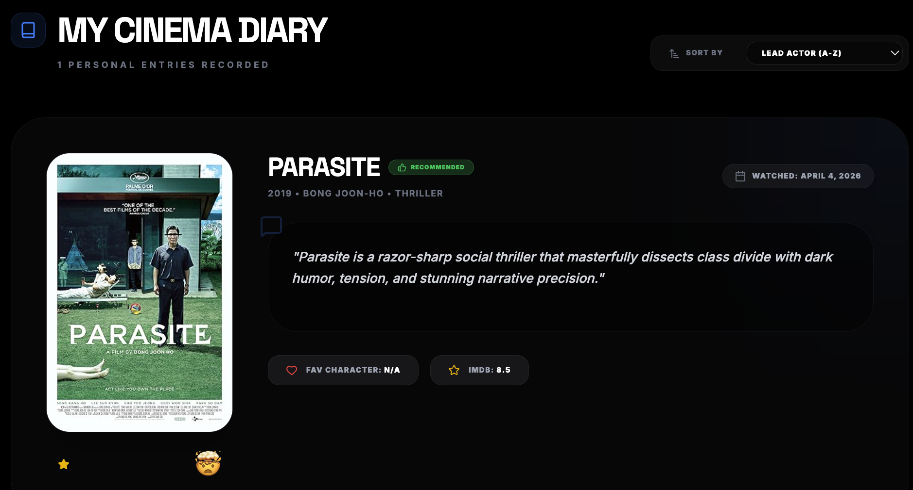
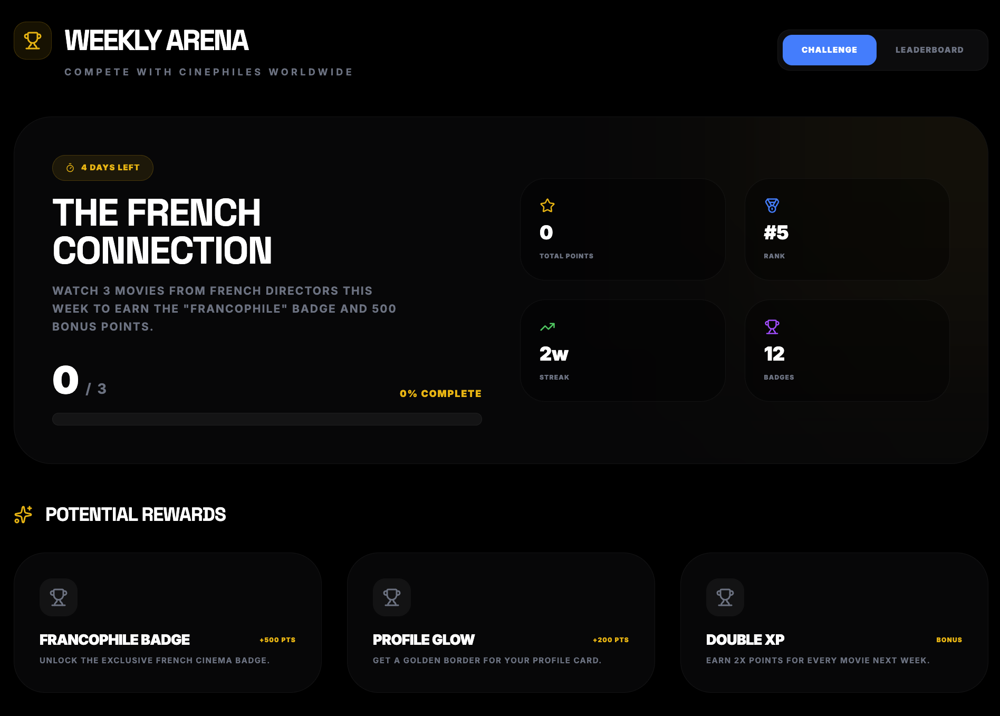

# 🎬 CineTrack

### Your Cinema, Your Rules.

### Cinematic journaling system built around discovery, reflection, and global movie exploration.

 

  

<i>"Movie tracking should feel like revisiting memories, not filling spreadsheets."</i>

---

## 🌍 Live Product

<a href="https://aura-cinetrack.vercel.app">Visit Live Product ↗</a>

---

# 📸 Product Preview

## Dashboard Experience

The home dashboard was designed to reduce decision fatigue and immediately pull users into the experience through mood-based discovery, curated recommendations, and cinematic UI design.

---

## 🌎 World Cinema Map — Signature Feature

The World Cinema Map became the defining experience of CineTrack.

As users log films from different countries, those countries light up visually on the map — transforming movie tracking into a cinematic passport.

This feature encouraged users to explore international cinema more intentionally and became the most memorable part of the product experience.

---

## 🎭 Taste Evolution

Taste Evolution helps users understand how their cinematic preferences change over time through Genre DNA visualizations, rating patterns, and Cinema Personality summaries.

Rather than showing only statistics, the feature was designed to make users reflect on how their viewing habits evolve.

---

## ⚡ Quick Log — Reducing Logging Friction

One of the biggest user frustrations observed early was that full journaling forms felt exhausting after finishing a movie.

The Quick Log system allows users to instantly record a title and rating in seconds, significantly reducing the gap between watching and logging.

---

## 😊 Mood-Based Discovery

Instead of starting with AI-heavy recommendations, CineTrack introduced emotional discovery modes such as Laugh, Cry, Mind-Blown, Feel Good, and Adrenaline.

This made discovery feel intuitive and emotionally driven rather than algorithmically overwhelming.

---

## 📖 My Cinema Diary

CineTrack treats movie tracking as reflection rather than simple collection.

The diary system combines reviews, personal notes, ratings, moods, and memorable moments into a more immersive journaling experience.

---

## 🏆 Weekly Arena & Retention Systems

Lightweight progression systems such as weekly themed challenges, streaks, and rewards were introduced to encourage consistency without making the experience feel overly gamified.

# 📘 Product Documents

| Resource | Access |
|---|---|
| Product Case Study | [View PDF](docs/CineTrack_Case_Study.pdf) |
| Product Requirements Document | [View PRD](docs/CineTrack_PRD.pdf) |
| Live Product | [Open CineTrack](https://aura-cinetrack.vercel.app) |

---

# 🧠 Product Thinking

CineTrack was designed around a few core product principles:

- Reduce friction between watching and logging
- Make movie tracking feel reflective rather than transactional
- Encourage cinematic exploration naturally
- Create emotionally memorable interactions
- Prioritize immersive UX over feature overload

---

# 🛠️ Tech Stack

| Layer | Technology |
|---|---|
| Frontend | React + TypeScript |
| Styling | Tailwind CSS |
| Animation | Framer Motion |
| Database | Firebase Firestore |
| Visualization | D3.js + Recharts |
| Deployment | Vercel |

---

# 📚 Documentation

| Document | Purpose |
|---|---|
| `docs/CineTrack_Case_Study.pdf` | Full PM-style product case study |
| `docs/CineTrack_PRD.pdf` | Product Requirements Document |
| `ARCHITECTURE.md` | Product architecture overview |
| `PRODUCT_THINKING.md` | Product decisions and rationale |
| `FUTURE_ROADMAP.md` | Planned future evolution |
| `KNOWN_LIMITATIONS.md` | Current product limitations |
| `CHANGELOG.md` | Product iteration history |
| `SETUP.md` | Local setup instructions |

---

# 🚀 Core Product Highlights

- Cinematic journaling experience
- Interactive World Cinema Map
- Taste Evolution analytics
- Quick Log low-friction entry flow
- Mood-based discovery system
- Weekly Arena challenges
- CSV import/export support
- Firebase cloud sync
- Responsive cinematic UI

---

# 👨‍💻 Author

### Arunjyoti Kalita

🎓 MBA (Marketing & Strategy) — IIM Ranchi  
🚀 Aspiring Product Manager | AI & Automation Builder  
⚡ Exploring AI workflows, product intelligence systems, and automation-led user insights

 

  

  &nbsp;&nbsp;

  
  &nbsp;&nbsp;

  

---
